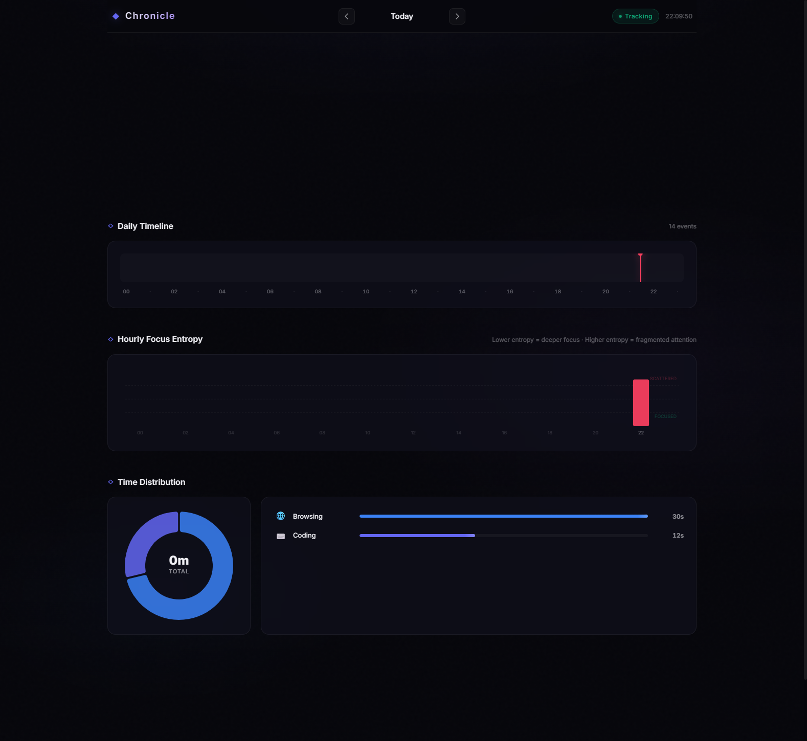

# Chronicle

**Passive time tracking and productivity intelligence for Windows.** Maps window activity, computes deep focus metrics, and renders timelines — all locally.




---

## The Problem

Most time-tracking tools require manual start/stop interactions, leading to gaps in logging, or upload detailed, personal desktop activity to third-party cloud servers. Furthermore, generic category summaries (e.g., spending 3 hours in "Google Chrome") fail to capture context or measure the actual quality of attention—ignoring whether those 3 hours were spent context-switching between tabs or in deep deep focus.

## The Solution

**Chronicle** runs quietly in the Windows system tray, passively logging foreground window activity and active titles every few seconds. It stores all data locally in an SQLite database. It computes a custom "Focus Entropy" metric that measures attention fragmentation and renders a responsive dashboard featuring interactive timeline visualizations, activity breakdowns, and daily focus scorecards.

---

## Features

- **Passive Window Monitoring** — Captures active window titles, process names, and timestamps every 3 seconds without background CPU load.
- **Focus Entropy Metric** — Calculates normalized Shannon entropy per hour to quantify attention fragmentation (low entropy = sustained deep focus; high entropy = rapid context-switching).
- **Session Stitching Engine** — Collates raw window events into continuous focus sessions using configurable idle thresholds and gap tolerances.
- **Automated Rules Classifier** — Categorizes activities (e.g., Coding, Writing, Entertainment) by checking window titles against user-defined regex rules.
- **Interactive D3.js Timelines** — Visualizes your day as a fluid chronological strip with hover tooltips and category filter toggles.
- **System Tray Integration** — Lives in the Windows tray with simple controls to pause/resume tracking, launch the dashboard, or quit.
- **Zero-Cloud Privacy** — Database, collection, and visualization run entirely on your local machine.

---

## Tech Stack

- **Backend**: FastAPI + Python 3.11+
- **Frontend**: Vanilla JS + D3.js v7 + Tailwind CSS (served locally)
- **Database**: SQLite (WAL mode for concurrent tracker/dashboard reads)
- **Monitoring**: Native Win32 API bindings (via Python `ctypes`)
- **Animation**: GSAP (GreenSock Animation Platform)

---

## Quick Start

### Prerequisites

- Windows 10 or 11
- Python 3.10+
- Administrator privileges (required for global keyboard listeners if enabled, and reliable foreground window hook binding)

### Installation & Run

1. **Clone the repository:**
   ```bash
   git clone https://github.com/shreyasfegade/chronicle.git
   cd chronicle
   ```

2. **Install dependencies:**
   ```bash
   pip install -r requirements.txt
   ```

3. **Start the application:**
   ```bash
   python app.py
   ```

This will initialize the database, start the passive background tracker thread, launch the tray utility, and automatically open the web dashboard in your default browser at [http://localhost:7745](http://localhost:7745).

---

## Architecture

```text
chronicle/
├── app.py             # Main entry point (starts tracker, server, and tray)
├── tracker.py         # Win32 polling loop and foreground window detector
├── database.py        # SQLite schema initialization and write pipeline
├── sessions.py        # Focus session aggregation and stitching algorithms
├── metrics.py         # Focus entropy calculations and daily score aggregations
├── classifier.py      # Rule-based regex activity categorizer
├── server.py          # FastAPI server serving the local dashboard API
├── tray.py            # System tray icon setup and controls (via pystray)
├── static/            # Dashboard webassets (HTML, CSS, D3.js visualization scripts)
├── LICENSE            # MIT License
└── README.md          # Project documentation
```

---

## Current Status

This project is a **fully functional local utility**.

- **Implemented**: Background window polling, sqlite write pipeline with session stitching, Focus Entropy math, rule-based categorization, system tray controls, and a complete D3.js dashboard view.
- **In Progress**: Local desktop notifications when focus entropy exceeds high thresholds (indicating severe distraction).
- **Planned**: Multi-monitor activity detection (tracking window sizing/positioning offsets).

---

## Architecture

```
┌─────────────────┐         ┌─────────────────┐         ┌─────────────────┐
│    TRACKER      │         │   PROCESSOR     │         │   DASHBOARD     │
│                 │         │                 │         │                 │
│ • Win32 ctypes  │────────►│ • Regex Classif.│────────►│ • FastAPI       │
│ • GetForeground │  raw    │ • Session Stitch│ metrics │ • D3.js         │
│ • 3s polling    │  events │ • Shannon H(X)  │ + focus │ • Timeline      │
│ • Process names │         │ • SQLite (WAL)  │ entropy │ • Category Bars │
└─────────────────┘         └─────────────────┘         └─────────────────┘
```

### Data Flow

```
1. Active window polled ───────────────── every 3s (Win32 ctypes)
   ↓
2. Title captured ─────────────────────── ~5ms (GetWindowTextW UTF-16)
   ↓
3. Category matched ───────────────────── ~2ms (ordered regex rules)
   ↓
4. Session stitched ───────────────────── ~15ms (merge if gap <60s, same category)
   ↓
5. Focus Entropy computed ─────────────── ~10ms (Shannon H(X) over 1hr window)
   ↓
6. Dashboard rendered ─────────────────── ~30ms (D3.js timeline + category bars)

Query response: ~30ms from request to full dashboard
```

Window titles are classified before process names — so `chrome.exe` showing YouTube gets classified as Entertainment, while `chrome.exe` showing Google Docs gets classified as Writing.

Focus Entropy uses Shannon Entropy to quantify attention quality:
$$H(X) = -\sum_{i=1}^n P(x_i) \log_2 P(x_i)$$
Normalized to 0.0–1.0, where 0 = deep focus on one window, 1 = rapid switching across many.


---

## Limitations

- **Windows Dependent**: Relies entirely on Win32 user library DLL calls; incompatible with macOS or Linux.
- **Manual Rules**: Requires initial category classifications to be configured manually via rules; unrecognized titles fall back to a "General" category.
- **Single Monitor Focus**: Only logs the window currently in the foreground; background window operations (like background videos) are ignored.
- **Browser Title Dependency**: Browser tab titles must contain identifying terms in the window title string; browsers running in private/incognito mode that hide titles cannot be categorized dynamically.

---

## What This Project Taught Me

- How Windows native APIs (`ctypes`, `GetForegroundWindow`) enable desktop automation without third-party dependencies.
- Why concurrent database access needs WAL mode to prevent lock conflicts between background writers and frontend readers.
- How Shannon Entropy can quantify abstract concepts like "attention quality" into actionable metrics.
- The architecture of system tray applications with background worker threads and web-based dashboards.

## Development Note

**Built with AI-assisted development.** I directed the product vision, designed the metrics framework, and made the architecture decisions. AI tools accelerated the implementation.

My contributions:
- The core idea: treating developer attention as a quantifiable resource using information theory.
- Designing the Focus Entropy algorithm to measure attention quality, not just time spent.
- Architecture: combining a background tracker thread with a FastAPI web server and system tray daemon.
- UX direction for the D3.js timeline visualizations and daily focus scorecards.

---

## License

This project is licensed under the MIT License - see the [LICENSE](LICENSE) file for details.
