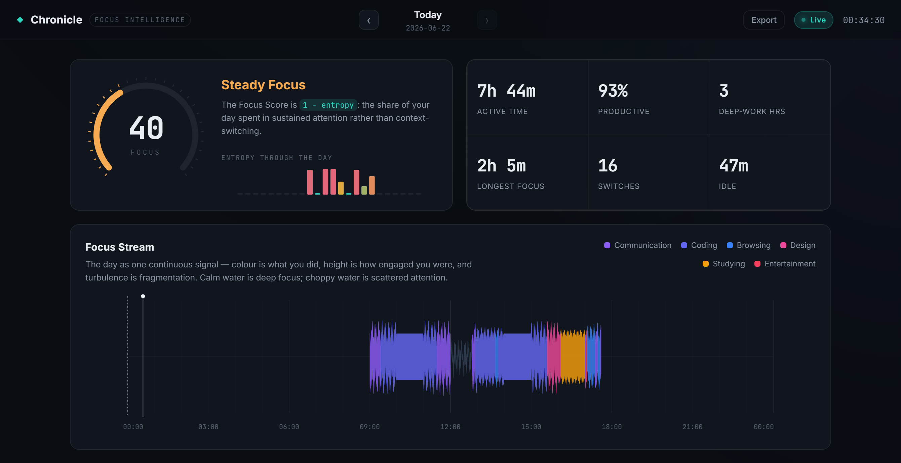
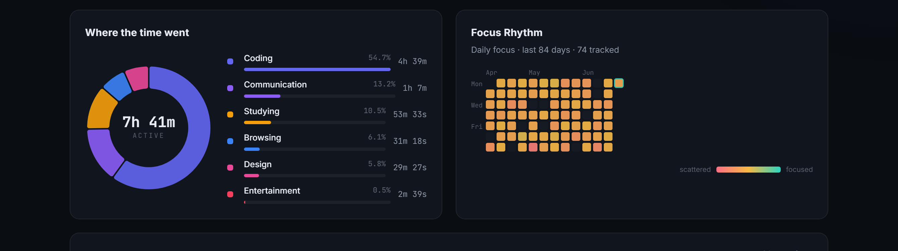
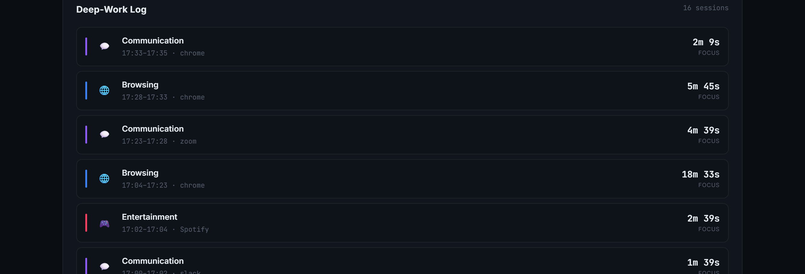

# Chronicle

**Passive focus intelligence for Windows.** Chronicle runs quietly in your system
tray, watches which window has your attention, and turns that raw signal into a
single, honest number — a **Focus Score** built from Shannon entropy — rendered
through a hand-built D3 dashboard. Everything stays on your machine.




> The screenshots in this README are from generated sample data (`scripts/seed_demo.py`)
> so the visualizations have something to show. Your own data accrues as you use it.

---

## The problem

Most time trackers answer the wrong question. They tell you that you spent three
hours in "Chrome" — but not whether those three hours were one deep, unbroken
research session or ninety frantic tab-switches between Slack, email, and YouTube.
Time-in-app is easy to measure and nearly useless as a measure of attention.

The tools that *do* try to measure focus usually ask you to start and stop timers
by hand (so the data is full of gaps), or they ship your entire desktop activity
to someone else's cloud.

## The solution

Chronicle treats your attention as a **signal** and measures its *disorder*.

It samples the foreground window every few seconds and classifies it (Coding,
Communication, Studying, …). For each hour it builds a distribution over those
categories and computes the **normalized Shannon entropy**: an hour spent entirely
in one category has entropy `0` (deep focus); an hour split evenly across many has
entropy near `1` (fragmented). The **Focus Score** is `1 − entropy`, weighted by
activity — the share of your day spent in sustained attention rather than
context-switching.

All collection, storage, and visualization happen locally. Nothing leaves the
machine; there is no account, no network call, no telemetry.

---

## The dashboard

The centerpiece is the **Focus Stream** — the whole day drawn as one continuous
ribbon. Colour is *what* you were doing, height is *how engaged* you were, and the
turbulence of the ribbon's edges is entropy itself: deep-focus hours flow as calm,
smooth water, while scattered hours fray into a choppy waveform. The metric isn't
just printed — it's something you can *see*.

| Activity breakdown & multi-week rhythm | Deep-work log |
| --- | --- |
|  |  |

- **Focus Rhythm** — a multi-week heatmap of daily Focus Score (it doubles as a
  date picker: click any day to jump to it).
- **Focus gauge + entropy sparkline** — the day's score with its hour-by-hour
  entropy beneath it.
- **Where the time went** — a category donut and ranked breakdown.
- **Deep-Work Log** — your raw polls stitched back into the handful of focus
  blocks you'd actually recognize, longest highlighted.

Navigate days with the arrows or `←` / `→`, jump home with `T`, and export any
day to CSV.

---

## Quick start

**Requirements:** Windows 10/11 and Python 3.10+. No administrator rights needed.

```bash
git clone https://github.com/shreyasfegade/chronicle.git
cd chronicle
pip install -r requirements.txt

# (optional) generate a few weeks of sample data to explore the dashboard
python scripts/seed_demo.py --days 84

python app.py
```

`python app.py` initializes the database, starts the background tracker, drops an
icon in the system tray, and opens the dashboard at
[http://localhost:7745](http://localhost:7745). It is equivalent to
`python -m chronicle`. Right-click the tray icon to pause/resume tracking or quit.

Leave it running. The longer it runs, the more your real focus patterns emerge.

---

## Configuration

Everything tunable lives in [`chronicle/config.py`](chronicle/config.py) with sane
defaults. To override, copy `config.example.json` to `config.json` and edit it, or
set `CHRONICLE_*` environment variables (`CHRONICLE_PORT=8000`, …).

| Key | Default | Meaning |
| --- | --- | --- |
| `poll_interval` | `3.0` | Seconds between foreground-window samples |
| `idle_threshold` | `120` | Seconds without input before time counts as `Idle` |
| `session_gap_threshold` | `60` | Max gap (s) still merged into one focus session |
| `session_min_duration` | `30` | Sessions shorter than this (s) are dropped as noise |
| `port` / `host` | `7745` / `127.0.0.1` | Dashboard server binding |
| `custom_rules` | — | Add your own app/title → category rules |

Custom classification needs no code. For example, to file your editor under
*Coding* and any Jira tab under *DevOps*:

```json
{
  "custom_rules": {
    "exe":   { "myeditor": "Coding" },
    "title": [["jira|confluence", "DevOps"]]
  }
}
```

---

## Architecture

```
┌──────────────┐   raw events   ┌──────────────┐   derived   ┌──────────────┐
│   TRACKER     │ ─────────────► │   STORAGE     │ ──────────► │  DASHBOARD    │
│               │                │               │             │               │
│ Win32 ctypes  │  every ~3s     │ SQLite (WAL)  │  on demand  │ FastAPI + D3  │
│ foreground +  │  one row /     │ single events │  entropy,   │ Focus Stream  │
│ idle polling  │  poll          │ table         │  sessions   │ + heatmap     │
└──────────────┘                └──────────────┘             └──────────────┘
```

The raw `events` table is the single source of truth. Sessions and Focus Scores
are derived from it at request time (a day is only a few thousand rows), so there
are no caches to go stale; the multi-week heatmap pushes its aggregation down into
SQL to stay fast over months of data. SQLite runs in **WAL mode** so the tracker
(writer) and the dashboard (readers) never block each other.

```
chronicle/
├── chronicle/                 # application package
│   ├── app.py                 # bootstrap — wires tracker + server + tray
│   ├── config.py              # file/env-backed configuration
│   ├── platform.py            # isolated Win32 ctypes (foreground window + idle)
│   ├── tracker.py             # background polling loop
│   ├── database.py            # SQLite (WAL) storage layer
│   ├── classifier.py          # rule-based categorisation
│   ├── sessions.py            # raw events → focus sessions
│   ├── metrics.py             # Focus Score / Shannon entropy
│   ├── server.py              # FastAPI app + JSON API
│   ├── tray.py                # system-tray icon and controls
│   └── logging_setup.py       # console + rotating-file logging
├── static/                    # dashboard (no build step)
│   ├── index.html
│   ├── css/style.css
│   └── js/{util,stream,heatmap,charts,app}.js
├── scripts/seed_demo.py       # generate realistic sample data
├── app.py                     # launcher (python app.py)
├── config.example.json
└── requirements.txt
```

### Tech stack

- **Tracking:** native Win32 API via the standard-library `ctypes` — no `pywin32`.
- **Backend:** FastAPI + Uvicorn, Python 3.10+.
- **Storage:** SQLite in WAL mode.
- **Frontend:** vanilla JS and **D3 v7**, hand-built. No charting library, no CSS
  framework, no build step — every pixel of every chart is drawn from the data.
- **Tray:** `pystray` + `Pillow` (both optional; Chronicle runs headless without them).

---

## Limitations

Chronicle is honest about what it can and can't see:

- **Windows only.** It binds directly to Win32 DLLs through `ctypes`; there is no
  macOS or Linux support.
- **Foreground only.** It tracks the single focused window. A video playing behind
  your editor is invisible to it, by design.
- **Titles drive browser classification.** A browser tab is categorized from its
  title text, so private/incognito windows that hide titles fall back to generic
  *Browsing*, and unknown apps land in *Other* until you add a rule.
- **Durations are sampled, not exact.** Each event stands for one poll interval, so
  times are accurate to within a few seconds, not to the millisecond.
- **Entropy measures category mixing.** At hour granularity, healthy task-switching
  (a quick Slack check mid-coding) and genuine distraction can look similar. The
  Focus Score is a useful lens on your day, not a verdict on it.

---

## A note on building this

This project was built with AI assistance; the concept, the metric design, and the
visual direction are mine, and I reviewed and shaped everything that went in. Three
things were genuinely fiddly on *this* project specifically:

- **The Win32 layer is quietly hostile.** `GetForegroundWindow` happily hands back
  stale handles during desktop transitions, `OpenProcess` is refused outright for
  elevated or protected processes, and `GetTickCount` wraps every ~49 days. Getting
  every call to degrade to "skip this poll" instead of crashing a daemon that's
  meant to run for weeks took more care than the happy path suggests — declaring
  `argtypes`/`restypes`, choosing the least-privilege access flag that still works,
  and never letting a bad poll escape the loop.

- **Making entropy *legible* was the real design problem.** A Focus Score of 0.41
  means nothing to a stranger. The Focus Stream exists to make the number physical:
  mapping entropy to the amplitude of an edge-turbulence noise field so that "your
  attention was fragmented" looks like choppy water. Tuning that — and noticing
  along the way that normalized entropy pins to `1.0` whenever two categories are
  evenly split, which is why boundary hours read as scattered — was the part that
  took the most iteration.

- **Synthetic data is harder than it looks.** Generating a believable demo day
  meant giving activity realistic *dwell* (you don't switch apps every three
  seconds) and threading a single monotonic time cursor through the day so that
  generated sessions stay contiguous instead of interleaving into noise.

---

## License

MIT — see [LICENSE](LICENSE).
